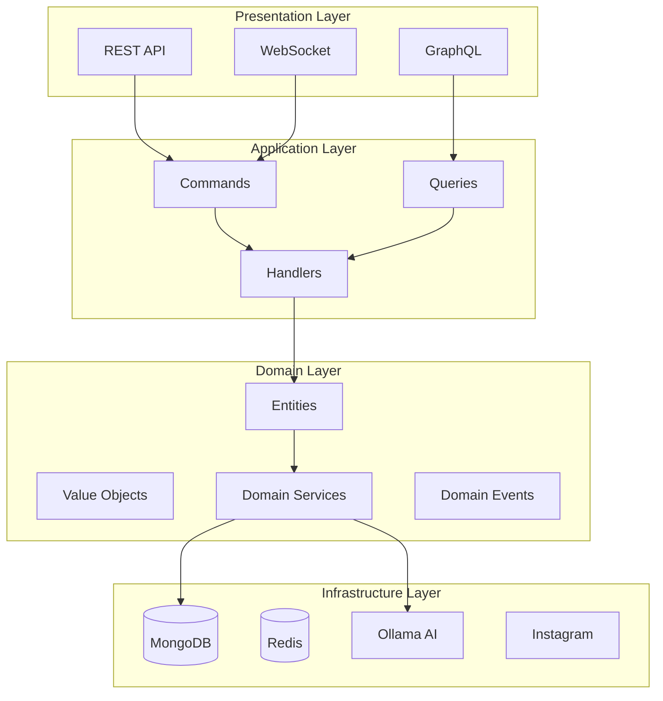

# 🏗️ Architecture Overview

## System Architecture

Riona AI Agent is built using **Hexagonal Architecture** (Ports and Adapters) combined with **Domain-Driven Design (DDD)** principles.



## Core Principles

### 1. Hexagonal Architecture

The architecture separates concerns into distinct layers:

- **Domain Layer**: Core business logic, independent of frameworks
- **Application Layer**: Use cases and orchestration
- **Infrastructure Layer**: External services and adapters
- **Presentation Layer**: API endpoints and user interfaces

### 2. Domain-Driven Design

Key DDD patterns implemented:

- **Entities**: Objects with identity (Agent, Post, Campaign)
- **Value Objects**: Immutable objects (Personality, Caption, Hashtag)
- **Aggregates**: Consistency boundaries
- **Repositories**: Data access abstraction
- **Domain Services**: Complex business operations
- **Domain Events**: Event-driven architecture

### 3. CQRS Pattern

Command Query Responsibility Segregation:

- **Commands**: Write operations (CreatePost, TrainAgent)
- **Queries**: Read operations (GetAnalytics, ListPosts)
- **Handlers**: Process commands and queries

## Layer Details

### Domain Layer

```typescript
// Entity Example
class Agent {
  constructor(
    private readonly id: AgentId,
    private personality: Personality,
    private model: AIModel,
    private trainingData: TrainingData[]
  ) {}

  train(data: TrainingData): Result<void> {
    // Business logic
  }

  generateContent(prompt: Prompt): Result<Content> {
    // Business logic
  }
}

// Value Object Example
class Personality {
  constructor(
    private readonly tone: Tone,
    private readonly style: Style,
    private readonly topics: Topic[]
  ) {}
}
```

### Application Layer

```typescript
// Command Example
class GenerateCaptionCommand {
  constructor(
    public readonly agentId: string,
    public readonly image: Buffer,
    public readonly style: string
  ) {}
}

// Handler Example
class GenerateCaptionHandler {
  async execute(command: GenerateCaptionCommand): Promise<Result<Caption>> {
    const agent = await this.agentRepo.findById(command.agentId);
    const caption = await agent.generateCaption(command);
    await this.eventBus.publish(new CaptionGeneratedEvent(caption));
    return Result.ok(caption);
  }
}
```

### Infrastructure Layer

```typescript
// Adapter Example
class OllamaAdapter implements IAIService {
  async generate(prompt: string): Promise<string> {
    const response = await this.client.generate({
      model: 'llama2:20b',
      prompt: prompt
    });
    return response.text;
  }
}

// Repository Implementation
class MongoAgentRepository implements IAgentRepository {
  async findById(id: string): Promise<Agent | null> {
    const doc = await AgentModel.findById(id);
    return doc ? this.toDomain(doc) : null;
  }
}
```

### Presentation Layer

```typescript
// Controller Example
@Controller('/api/v3/agent')
class AgentController {
  @Post('/generate-caption')
  async generateCaption(@Body() dto: GenerateCaptionDto) {
    const command = new GenerateCaptionCommand(
      dto.agentId,
      dto.image,
      dto.style
    );
    const result = await this.commandBus.execute(command);
    return result.isSuccess 
      ? { success: true, data: result.value }
      : { success: false, error: result.error };
  }
}
```

## Data Flow

### Write Operation Flow

1. **Request** → Controller receives HTTP request
2. **Validation** → DTO validation and transformation
3. **Command** → Create command object
4. **Handler** → Command handler processes business logic
5. **Domain** → Domain entities execute business rules
6. **Repository** → Persist changes to database
7. **Events** → Publish domain events
8. **Response** → Return result to client

### Read Operation Flow

1. **Request** → Controller receives query request
2. **Query** → Create query object
3. **Handler** → Query handler fetches data
4. **Repository** → Read from database/cache
5. **Projection** → Transform to read model
6. **Response** → Return data to client

## Technology Choices

### Backend Technologies

| Layer | Technology | Purpose |
|-------|------------|---------|
| Runtime | Node.js 20+ | JavaScript runtime |
| Language | TypeScript 5+ | Type safety |
| Framework | Express/NestJS | HTTP server |
| DI Container | InversifyJS | Dependency injection |
| Database | MongoDB | Document storage |
| Cache | Redis | Caching & sessions |
| WebSocket | Socket.io | Real-time communication |
| AI Integration | Ollama | Local LLM |
| Automation | Playwright | Browser automation |

### Frontend Technologies

| Component | Technology | Purpose |
|-----------|------------|---------|
| Framework | React 18 | UI framework |
| Language | TypeScript | Type safety |
| Bundler | Vite | Fast builds |
| Styling | TailwindCSS | Utility CSS |
| State | Zustand | State management |
| Data Fetching | React Query | Server state |
| Forms | React Hook Form | Form handling |
| UI Components | Radix UI | Accessible components |

## Scalability Considerations

### Horizontal Scaling

- **Stateless API**: All API servers are stateless
- **Session Storage**: Redis for shared sessions
- **Load Balancing**: Nginx/HAProxy for distribution
- **Database Sharding**: MongoDB sharding for large datasets

### Performance Optimizations

- **Caching Strategy**: Multi-layer caching (Redis, CDN)
- **Async Processing**: Queue system for heavy operations
- **Database Indexing**: Optimized MongoDB indexes
- **Code Splitting**: Lazy loading in frontend

### High Availability

- **Database Replication**: MongoDB replica sets
- **Redis Sentinel**: Automatic failover
- **Health Checks**: Kubernetes liveness/readiness probes
- **Circuit Breakers**: Prevent cascade failures

## Security Architecture

### Authentication & Authorization

- **JWT Tokens**: Stateless authentication
- **Refresh Tokens**: Secure token rotation
- **Role-Based Access**: RBAC implementation
- **API Keys**: Service-to-service auth

### Data Protection

- **Encryption at Rest**: MongoDB encryption
- **Encryption in Transit**: TLS/SSL
- **Secrets Management**: Environment variables
- **Input Validation**: Zod schemas

### Instagram Security

- **Session Management**: Encrypted cookies
- **2FA Support**: TOTP implementation
- **Rate Limiting**: Prevent API abuse
- **Proxy Support**: IP rotation

## Monitoring & Observability

### Logging

- **Structured Logging**: Winston with JSON format
- **Log Levels**: Error, Warn, Info, Debug
- **Centralized Logging**: ELK Stack integration

### Metrics

- **Application Metrics**: Prometheus format
- **Business Metrics**: Custom KPIs
- **Performance Metrics**: Response times, throughput

### Tracing

- **Distributed Tracing**: OpenTelemetry
- **Request Correlation**: Trace ID propagation
- **Performance Profiling**: Bottleneck identification

## Development Workflow

### Git Flow

```
main
  ├── develop
  │   ├── feature/ollama-integration
  │   ├── feature/campaign-builder
  │   └── feature/analytics-dashboard
  ├── release/v3.0.0
  └── hotfix/instagram-auth-fix
```

### CI/CD Pipeline

1. **Code Push** → GitHub
2. **CI Build** → GitHub Actions
3. **Tests** → Unit, Integration, E2E
4. **Code Quality** → SonarQube
5. **Container Build** → Docker
6. **Deploy** → Kubernetes

## Future Architecture Enhancements

### Planned Improvements

1. **Microservices Migration**
   - Separate AI service
   - Independent content service
   - Analytics microservice

2. **Event Sourcing**
   - Complete audit trail
   - Time-travel debugging
   - Event replay capability

3. **GraphQL Federation**
   - Unified API gateway
   - Schema stitching
   - Optimized data fetching

4. **Multi-Tenancy**
   - Agency support
   - Team collaboration
   - Resource isolation

## References

- [Hexagonal Architecture](https://alistair.cockburn.us/hexagonal-architecture/)
- [Domain-Driven Design](https://dddcommunity.org/)
- [CQRS Pattern](https://martinfowler.com/bliki/CQRS.html)
- [Clean Architecture](https://blog.cleancoder.com/uncle-bob/2012/08/13/the-clean-architecture.html)
